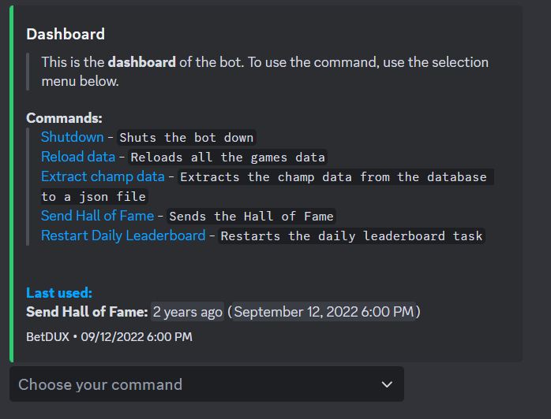
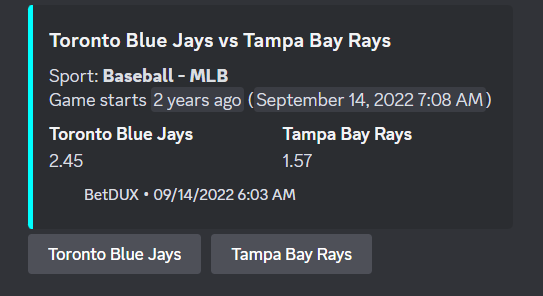
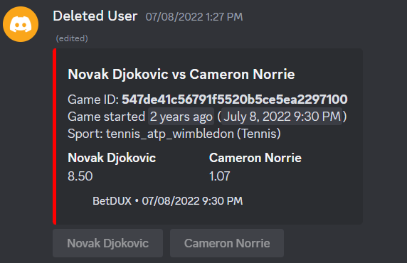
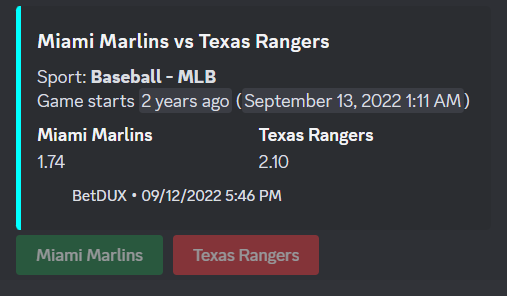
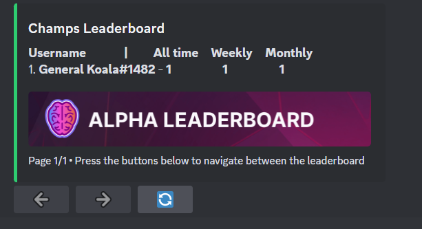
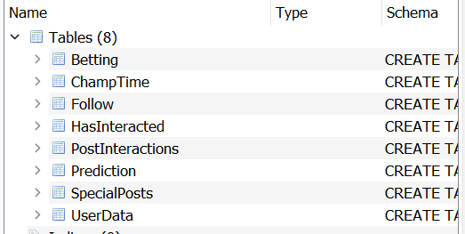

# BetDUX
Discord bot made for use in the BetDEX Discord server. It was used for more than a year until it was decided to retire the bot. 
- [BetDEX Website](https://www.betdex.com)

## Tools used
**For Discord API**:
- [JDA](https://github.com/discord-jda/JDA)
- [Chewtils](https://github.com/Chew/JDA-Chewtils)
  
**For console logging**:
- [Logback Classic](https://mvnrepository.com/artifact/ch.qos.logback/logback-classic)
  
**For Database Usage**:
- [SQLite](https://www.sqlite.org)
- [HikariCP](https://github.com/brettwooldridge/HikariCP)
  
**For fuzzy searching:**:
- [Fuzzy wuzzy](https://github.com/xdrop/fuzzywuzzy)

**For Sports Odds**:
- [Live sports odds API](https://rapidapi.com/theoddsapi/api/live-sports-odds)
    - Estimated monthly costs: either free or minor (under US$50 per month) 
    - [list of the sports available](https://the-odds-api.com/sports-odds-data/sports-apis.html)
    - [list of the betting markets available](https://the-odds-api.com/sports-odds-data/betting-markets.html)
    - [list of the bookmakers available](https://the-odds-api.com/sports-odds-data/bookmaker-apis.html#us-bookmakers)

## Images
### Dashboard

### Betting: IN PROGRESS

### Betting: WAITING FOR RESULTS (Match over)

### Betting: RESULTS SHOWN

### Leaderboard

### SQLite Database

## Summary

The product launch of the Education Clubhouse / BetDUX Bot will look like this:

- an Education Clubhouse with separate channels located in Discord server to incentivise educating, sharing of alpha and learning as explained in more detail in (2) below
- a new Bot (the BetDUX Bot) to (amongst other functions) integrate the BetDEX Beta product with the Education Clubhouse as explained in more detail in (2) and (3) below

## Education Clubhouse / Hall of Fame (channels)

The following channels will be set up (and the BetDUX Bot should be used as follows):
### Choose your Champ channel. Channel where a list of the current BetDEX Champs are displayed and a user can “follow” this athlete. 
**Features:**
- The posts from such BetDEX Champ in the relevant BetDEX Champs read-only channels are then automatically cross-posted as a message from the BetDUX Bot as a DM to the BetDEX user.
- Ability for P&L improvement tracker to be linked to BetDEX Champs and BetDEX athletes - i.e. the Discord user chooses athletes they are following (similar to eToro). If their improvement as an athlete comes in the sports that such BetDEX Champ or BetDEX athlete is actively sharing alpha in, the BetDEX athlete and BetDEX Champ are rewarded accordingly. Upon launch of the product we can consider an eToro style “follow” that “punt” approach. 

### BetDEX Champs (one for each Beta launch sport). Read-only channel for the previous week’s statistically proven top performers on the BetDEX Beta to post in. 

- File should be kept that contains the following details (1) Discord name of Champ (2) Wallet address of Champ (3) number of posts that have made it to the “BetDEX Hall of Fame” (4) number of posts that have received over [10] interactions (5) Champ in which sport (6) total number of weeks that the Champ has been a “Champ” in the relevant sport (7) number of BetDEX users that have chosen this BetDEX Champ in the “choose your Champ” channel.

### BetDEX Hall of Fame (performance). Realtime [top 10] performers by P&L for (1) each Beta Sport and (2) overall, each both daily, weekly, monthly and YTD (or “event to date”). [Top 10] performers should be divided into both (1) P&L (cash only and total percentage) and (2) most improved P&L (shown in percentage improvement each week). Populated by BetDUX Bot.

- File should be kept that contains the following data from the JSON file keeping track of Beta performance: (1) total P&L (cash only and as a percentage) for each user daily, weekly, monthly and all time in relevant sport (2) improved or decrease in P&L for each week for such user (3) total number of days each user is part of the BetDEX Hall of Fame for (1) P&L performance (cash only and total percentage) and (2) P&L improvement. 

- File should keep a list of low P&L performers (i.e. down by more than [20]% for a week) and such user can potentially be directed to education materials)

### Leaderboards
**We will be having five types of leaderboards:**
- A leaderboard for performance in each sport
- A leaderboard for performance “improvement” in each sport
- A leaderboard for performance “overall” (this should be at the top)
- A leaderboard for performance “improvement” “overall
- A leaderboard for performance in each “event” - for example, the 2022/23 English Premier League season or the 2022 World Cup

The leaderboard should be “clickable” so that it can show top 10 for that day, week, month, and all time.

**The leaderboard for performance should show:**
- the discord name of the user
- the total profit of that user in USD (weekly, monthly and year to date/YTD (or “since the start of the event” if for an event)
- The user’s last 5 results

_The only difference between the “event” and “non-event” leaderboards is the “event” leaderboard” should show “since the start of the event” as the longest period shown rather than “YTD”)._

**The leaderboard for “improvement” should show:**
- The discord name of the user
- The improvement in % of that user in percentage (weekly, monthly and YTD)
- The user’s last 5 results (W,W,W,L,W for example)
- The leaderboard should in addition to showing “top-10” should also show you (as the user) your position in each leaderboard (even if, for example, you are number 150). 

_It should update once daily._

**Additional features:**
- The leaderboard should be “clickable” so that it shows top 10 for that day, week, month, and all time (similar to the above example).
- The leaderboard should in addition to showing “top-10” should also show you (as the user) your position in each leaderboard (even if, for example, you are number 150). 
- There should be an option to search by Discord name.
- There should be a separate webpage where “all users” leaderboards is kept - so that users can see all the data for each user on the platform.
- To be clear - the leaderboards should be presented as “week, then click an arrow and the leaderboard should refresh that “month” and then click an arrow again and the leaderboard should refresh for “YTD”. Therefore, the leaderboard (and potentially the users) will be different for the weekly view, monthly view and YTD view.

### BetDEX Hall of Fame (Alpha). Top post of the week in:
- each sport specific (i.e. non BetDEX Champs channel);
- each BetDEX Champs channel 

_by user “interactions” with the relevant posts are cross posted to a BetDEX Hall of Fame (Alpha). All user interactions will be recorded (i.e. no specific requirement to post a “tennis emoji” to be considered, however we should make sure it can’t be “gamed” by a user - so only one user’s emoji per post should be counted towards the number of interactions below)._

**BetDEX Hall of Fame (Alpha) Database:** Each post that receives over [10] interactions should also be funnelled to a file where a record of the Alpha is kept (data should include (1) date and time of post (2) channel posted in (3) user name on Discord (4) total number of posts that has been “saved” in the file and (5) the content of the post. This should eventually (as suggested by Aidan) be curated by “keen” members of the community and we can post semi-regular updates with BetDEX “knowledge” blog posts / circulars with the top knowledge shared on sports betting from the community.

In addition to the “top weekly post” in Alpha being posted to this channel, we should have a separate BetDEX Alpha Leaderboard channel.

**The leaderboard for “alpha” should show:**
- The discord name of the user
- The total number of posts with more than [10] reactions for that week, month and YTD. This should be presented as “week, then click an arrow and the leaderboard should refresh that “month” and then click an arrow again and the leaderboard should refresh for “YTD”. Therefore, the leaderboard will be different for the weekly view, monthly view and YTD view.
- The leaderboard should in addition to showing “top-10” should also show you (as the user) your position in each leaderboard (even if, for example, you are number 150). 
- A link to that user’s top post of the week, month and YTD respectively.

### BetDEX Classroom. 
- Classroom for BetDEX customers to post questions in and for BetDEX Champs (both current and future) to respond (and receive BetBUX for doing so).
- File should keep a record of (1) number of questions asked by a user (2) number of questions responded to by a user (3) number of answers with more than [10] interactions 
- Answers with more than [10] interactions (and the question which such answer was responded to) should be funnelled to the BetDEX Hall of Fame (Alpha) Database described above.

### BetDEX Tutorials. 
- Voice channel. Regular tutorials will be hosted by BetDEX Champs.
- File should be kept which records the number of appearances by a Discord user in the Tutorials channel (1) each week and (2) all time.

### BetDEX Odds
- Read-only / interact only channel where odds for sporting competititons are posted and Discord users can interact to indicate their predictions. 
- The Bot should (1) post automatically 12 hours, 3 hours and 1 hour before “kick-off” of the relevant event in the relevant sports channels listed below. Users can interact with such Bot. The Bot should then post to the relevant sports channel after the event is finished with a list of Discord users who correctly predicted the result and provide a link to the Predictions Hall of Fame channel below. 

### Predictions Leaderboard
Prediction leaderboard should look as follows (one for each sport that we have predictions for):
- Discord username
- Last five results (i.e. W, L, W, L, W)
- Overall win / loss numbers for that week, month and YTD for a sport (for example, 45 W and 25 L)

File should be kept which records (1) number of interactions by a user (2) number of successful predictions by user (ordered by sport) (3) number of unsuccessful predictions by user (again, ordered by sport).

- There should be a leaderboard channel for the BetDEX Discord (Predictions Hall of Fame) which shows the top 10 best performers by predictions for each sport.

#### We will initially launch with the following sports:

**Launch sports (bookmaker / type of odds / bookmaker):**
American Football
NCAAF
Betfair
Decimal
American Football
NFL
Betfair
Decimal
Baseball
MLB
Betfair
Decimal
Basketball
NBA
Betfair
Decimal
Cricket
ICC World Cup
Betfair
Decimal
Cricket
IPL
Betfair
Decimal
Cricket
One Day Internationals
Betfair
Decimal
Cricket
Test Match
Betfair
Decimal
Golf
Masters I’m Tournament
Betfair
Decimal
Golf
PGA Championship
Betfair
Decimal
Golf
The Open
Betfair
Decimal
Golf
US Open
Betfair
Decimal
Ice Hockey
NHL
Betfair
Decimal
Mixed Martial Arts
MMA
Betfair
Decimal
Soccer
EPL
Betfair
Decimal
Soccer
FA Cup
Betfair
Decimal
Soccer
Fifa World Cup
Betfair
Decimal
Soccer
Ligue 1 - France
Betfair
Decimal
Soccer
Bundesliga - Germany
Betfair
Decimal
Soccer
Serie A - Italy
Betfair
Decimal
Soccer
Dutch Eresdivisie - Netherlands
Betfair
Decimal
Soccer
Primeria Liga - Portugal
Betfair
Decimal
Soccer
La Liga - Spain
Betfair
Decimal
Soccer
UEFA Champions League
Betfair
Decimal
Tennis
ATP French Open
Betfair
Decimal
Tennis
ATP US Open
Betfair
Decimal
Tennis
ATP Wimbledon
Betfair
Decimal

## BetDUX Bot (what Bot needs to do in more detail)

A new Bot to be built to connect the Beta product to the BetDEX Education Clubhouse - the BetDUX Bot. 

The Bot will be provided with access to the JSON file hosted on our Github that is maintained by the BetDEX engineering team (which updates the profit/loss figures and other recorded data every 24 hours). More details on what information the JSON file will store is set out in (4) below.

**Functions of the BetDUX Bot:**
- take data from the JSON database hosted on Github and populate BetDEX Hall of Fame (performance) channel as described above.
- take the following data for assisting with selection of BetDEX Champs (and keep in our internal records):
    - from the JSON database hosted on Github:
      - statistically best performers as per (4) below and as described in (2) above
    - the BetDEX Discord:
      - BetDEX Champs channel - frequency of posting and positive reactions from other Discord users (see (2) above for more details)
      - BetDEX Classroom channel - frequency of posting and positive reactions from other Discord users (see (2) above for more details)
      - BetDEX Odds channel - correct predictions (see (2) above for more details)
- to provide the statistics we need to choose BetDEX Champs and (eventually)  BetDEX Athletes. The choices will be via a “objective” test (see above) and “subjective” test (ultimately will be chosen by BetDEX team after reviewing weekly statistics). The File will need to provide easy access to the top performers as listed above to meet the “objective” test and allow BetDEX team easy access to   - make the “subjective” choice of who will be continuing/new BetDEX Champs for the next week.
- scrape odds from product relevant sports and feed to individual “odds” BetDEX Odds channels (see (2) above for more details)
- scrape “reactions” from such individual (product relevant) sport BetDEX Odds channels (again, a different channel for each product relevant sport) to create a running season by season performance ladder - for BetDEX users (this is a tester for mainnet launch - if popular we can take data from data feed and populate a list of top performers for a season for a given sport based on performance) (see (2) above for more details)
- scrape / fill all other information from section (2) above in relevant file(s)

## What data will be tracked (either currently or in due course) and stored in the JSON file from the Beta product?

### Data tracking:

**Sport specific (for example, football, tennis):**
- Daily P&L (amount)
- Daily P&L (%)
- Daily results for a specific sport (W/L) - for example, made bets on 2 tennis markets, and won both - they would be +2 for the day)

**Market specific:**
- Daily P&L (amount)
- Daily P&L (%)

### Event specific (for example, Wimbledon, US Open, World Cup, Premier League, La Liga):**
**Overall (across all markets for a given event):**
- Daily P&L (amount)
- Daily P&L (%)
- Daily results (W/L a bet)
- Market specific (each specific market for a given event):
- Daily P&L (amount)
- Daily P&L (%)
- Daily results (W/L a bet in a relevant market))

**Overall (across all sports)**
- Daily P&L (amount)
- Daily P&L (%)
- Daily results for all sports (W/L) - for example, made bets on 2 tennis markets and 1 football game - and won 1 bet and lost 2 - they would be -1 for the day. [EC note on 18 June: query the usefulness of this data - it wouldn’t capture the P&L of a bet (so could be gamed easily by choosing high probability bets.]

### What information do we need from the Beta users for the Education Clubhouse / BetDUX Bot?

- Discord username and Solana wallet address.
